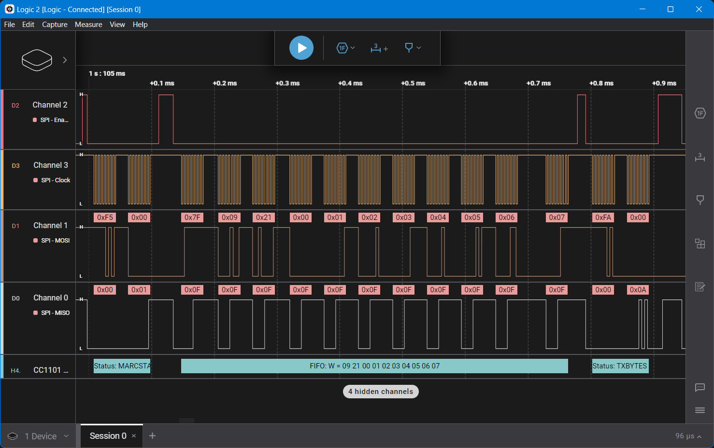
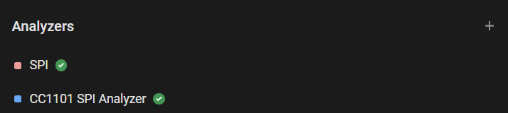
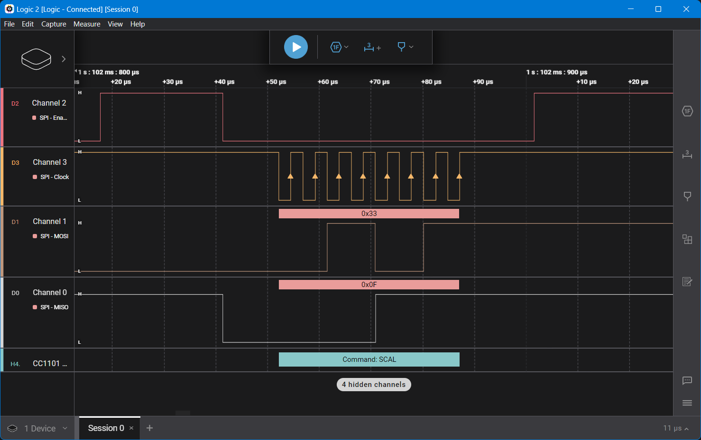
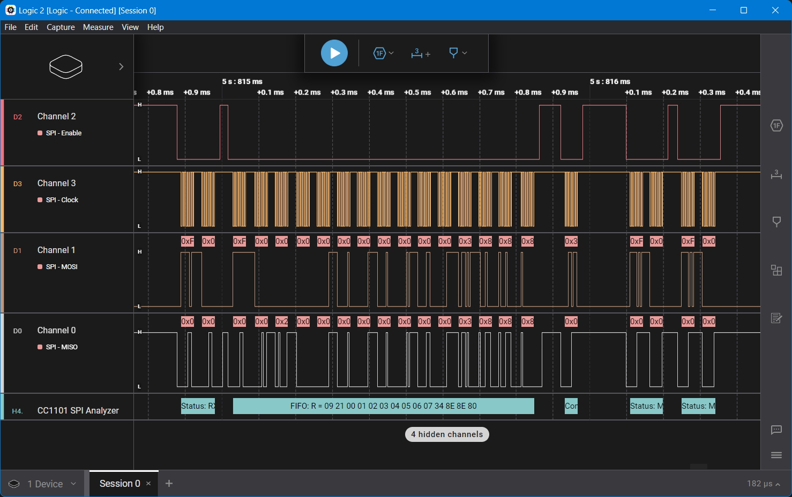
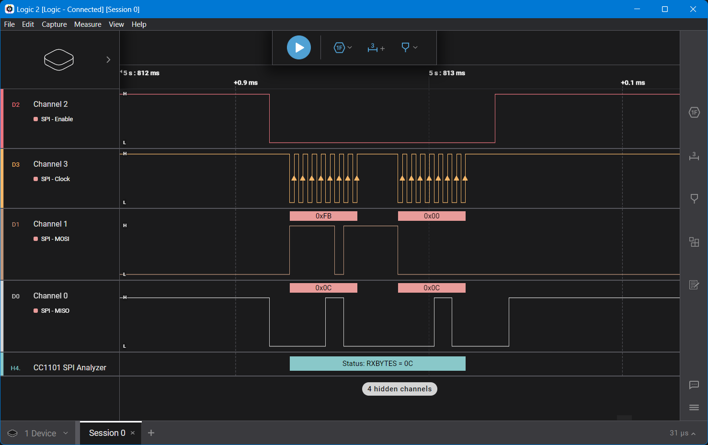
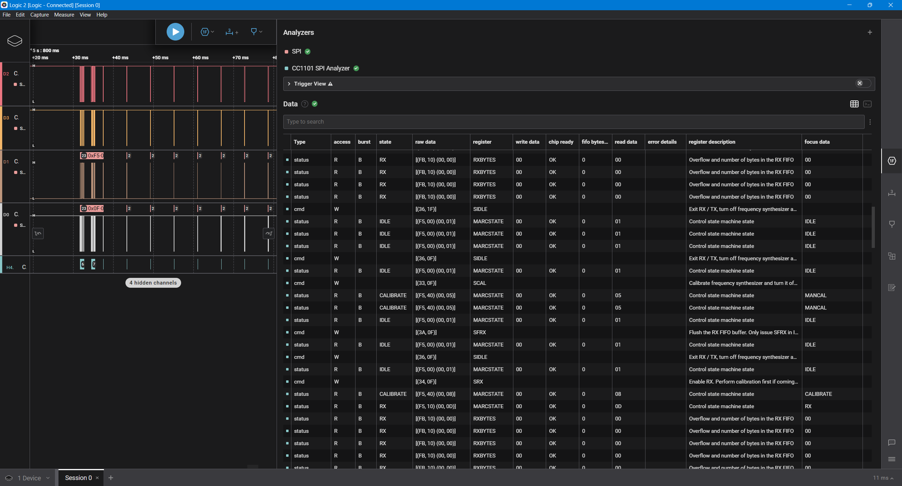
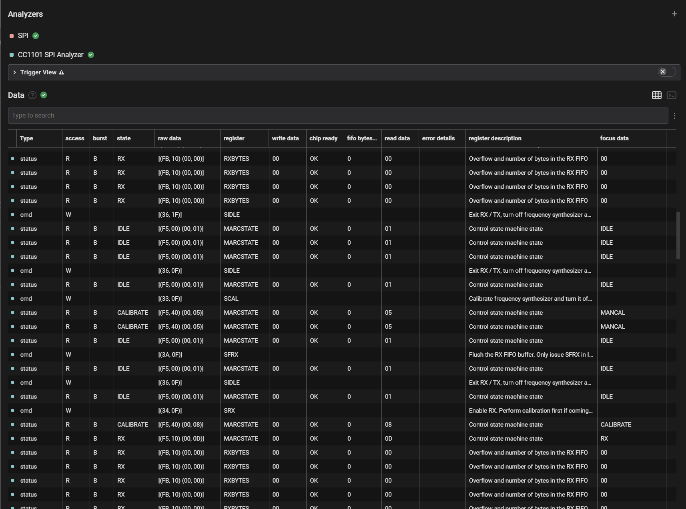

# CC1101 SPI Analyzer

SPI protocol analyzer for the Texas Instruments CC1101 RF Transceiver.

## Getting started

1. Installation
    - Install [Logic 2](https://www.saleae.com/pages/downloads) if not done already.
    - In Logic 2, go to *Extensions*, search for *CC1101 SPI Analyzer*, then click *INSTALL*.
2. Usage
    - Configure the *SPI* session with *Enable*(Chip Select), *Clock*, *MOSI* and *MISO* lines.
    - Go to *Analyzers*, click *+* and select *CC1101 SPI Analyzer* - associate it with *SPI*.
    
    - Click *Start Capture* to begin analyzing the SPI communication.

## Features

- Easy to use and complete CC1101 SPI protocol analyzer.
- View captured packets at a glance in the Graph View.
- View detailed capture in the Data Table.
- Use Trigger View to synchronize on specific packets.
- Export the data table for further analysis.
- Error messages for broken/invalid frames.

## Examples

- Command SCAL
    
- FIFO Read
    
- Read status register: RXBYTES
    
- Data Table view
    
- Data Table view
    

## Texas Instruments references
- [CC1101 Product Page](https://www.ti.com/product/CC1101)
- [CC1101 Datasheet](https://www.ti.com/lit/ds/symlink/cc1101.pdf)
- [CC1101 Silicon Errata](https://www.ti.com/lit/er/swrz020e/swrz020e.pdf)

## Contributing
Contributions are welcome! If you have suggestions or improvements, please submit a pull request or open an issue on GitHub.

## License

